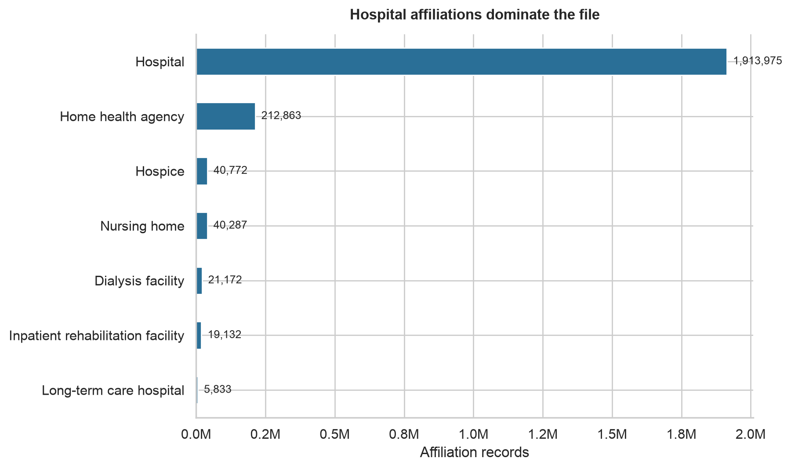
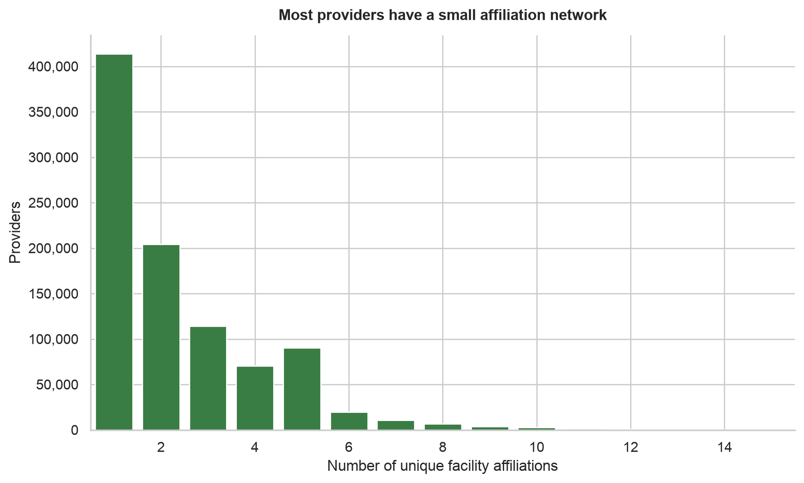
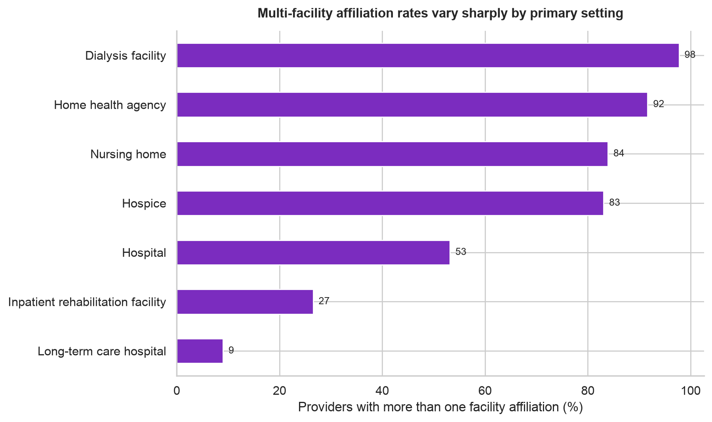
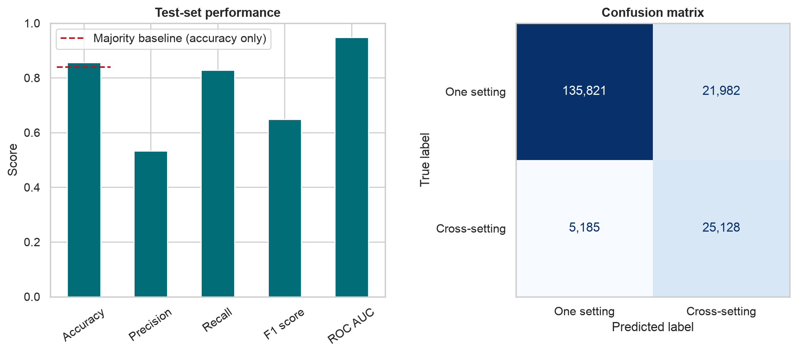

# One Provider, Many Doors: What 2.25 Million Medicare Affiliations Reveal

Healthcare looks connected from the outside, but the actual network is uneven. I analyzed 2,254,034 Medicare facility-affiliation records covering 940,577 providers to see how those connections are distributed and whether a simple model could identify providers who work across different care settings.

## 1. Which facilities dominate the data?

Hospitals account for 1,913,975 records, far more than any other setting. That was my first warning not to treat the national total as a balanced picture of healthcare. Hospital activity can easily drown out smaller settings such as hospice, dialysis, and long-term care.

## 2. How connected are individual providers?

The typical network is not huge. The median provider has two facility affiliations. Still, 56.0% are affiliated with more than one facility, and 16.1% cross into more than one type of care setting. That smaller cross-setting group may be especially important when health systems are planning transitions between hospital and follow-up care.

## 3. Where are multi-facility networks most common?

The differences are sharp. About 97.7% of dialysis-centered providers and 91.6% of home-health-centered providers have multiple facility affiliations. The rate falls to 9.0% for providers centered in long-term care hospitals. These are associations, not proof that a setting causes a larger network, but they show where I would investigate first.

## 4. Can the model spot cross-setting providers?

My logistic-regression model reached 85.6% accuracy and 83.0% recall on providers it had not seen during training. That accuracy is only 1.7 percentage points above the 83.9% majority baseline, so I would not call accuracy alone impressive. The model's 0.948 ranking score means it separates the two groups well across possible cutoffs. However, only 53.4% of the profiles it flags are actually cross-setting, so the false alarms matter.

For a realistic planning scenario, I tested a summarized hospital-centered profile with four affiliations while imagining that the setting details had not arrived yet. The model estimated a 56.8% chance that the affiliations cross care settings. I would use that result to prioritize a manual review, not to make an automatic decision. Once the complete facility-type history is available, the team should calculate the answer directly instead of using the model. The data can point us toward a useful question, but a person still needs to verify the answer.

*Source: Centers for Medicare & Medicaid Services, Facility Affiliation Data.*
